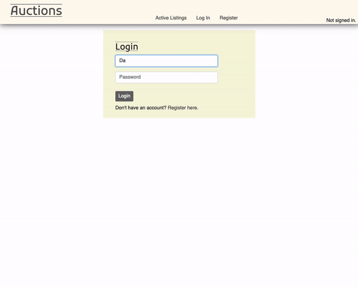

# Commerce site with Django and SQL
Design an eBay-like e-commerce auction site that will allow users to post auction listings, place bids on listings, comment on those listings, and add listings to a “watchlist.”

## Examples of use

  

## Live demo
* [Commerce Website](https://hrmtk-commerce.herokuapp.com/)

## General info
* View list of all active listings
* View a list of each category
* Create listing
* Add a listing to user's watchlist
* Get an message if the user has won the item

## Technologies
* HTML5
* CSS3
* Bootstrap
* JavaScript
* Python 3.9
* Django 3.2
* Postgresql

## Status
Project is: _finished_

## Inspiration
* [CS50's Web Programming with Python and JavaScript](https://cs50.harvard.edu/web/2020/projects/2/commerce/)

## Lisence
MIT